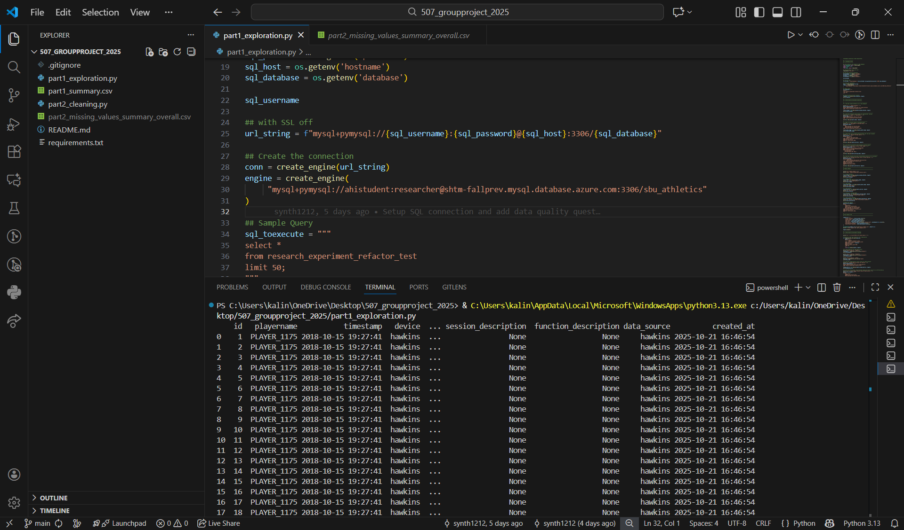

# 507_groupproject_2025
- This project analyzes longitudinal jump testing data from Stony Brook University Athletics. Using Hawkins force-plate metrics, we explore how force- and velocity-based variables relate to jump height and use those insights to build simple performance-monitoring tools.

## Group Members & Roles:
- Rozelle Thompson 
    - Role: Developer
- Cynthia Chen
    - Role: Team Lead
- Carson Chin
    - Role: Developer
- Kalin Yuen
    - Role: Developer
- Tanveer Kaur
    - Role: Researcher

## Setup Instructions (how to install dependencies)
- python3 -m venv venv
source venv/bin/activate   # Mac/Linux
venv\Scripts\activate      # Windows PowerShell

- pip install -r requirements.txt

## How to Run Each Script

## Database Connection Instructions

- sql_username = os.getenv('username')
    sql_password = os.getenv('password')
    sql_host = os.getenv('hostname')
    sql_database = os.getenv('database')

## Project Structure Overview

507_groupproject_2025/
├── part1_exploration.py          # Data exploration & quality checks (Part 1)
├── part2_cleaning.py             # Cleaning, long→wide transform, derived metrics (Part 2)
├── part3_visualization.py        # (Optional) Plots / dashboards (if created)
├── part4_flags.py                # Performance monitoring flag system (Part 4)
├── requirements.txt              # Python dependencies
├── test.env / .env               # Local DB credentials (not committed to Git ideally)
├── README.md                     # Project documentation (this file)
└── output/
    ├── part2_missing_values_summary_overall.csv
    ├── part2_wide_format_examples.csv
    └── part4_flagged_athletes.csv
## Screenshots (Evidence of Setup)

- Part 1 – Exploration (Kalin Yuen)  
  